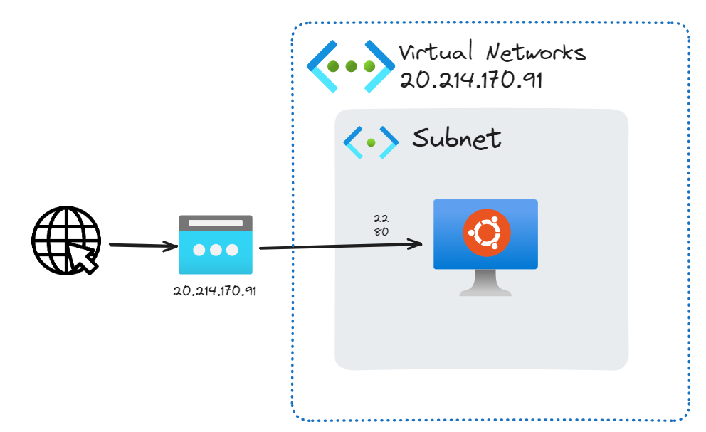
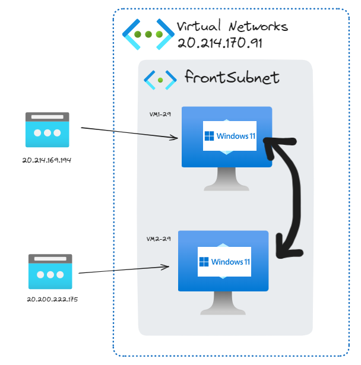
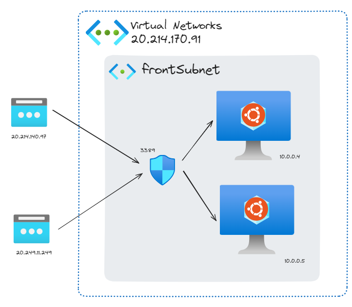
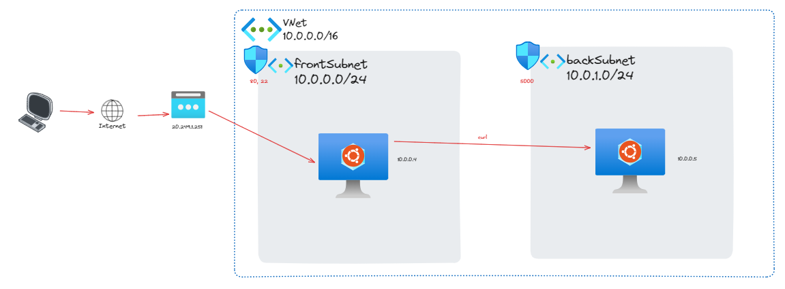
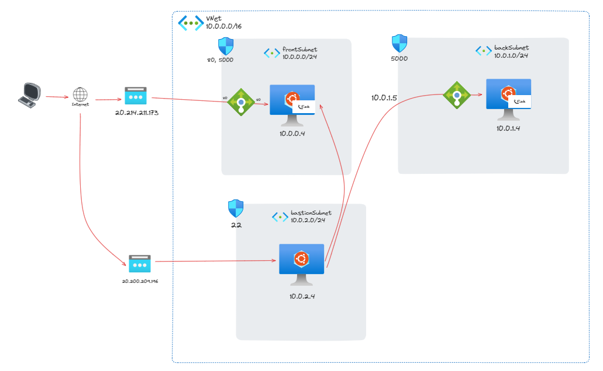
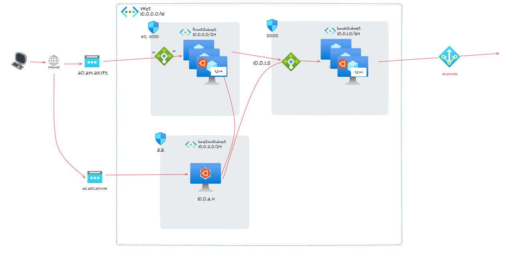

## Git
- Git 개발환경 설치
- Git 시작하기
- Add, Commit
- Reset, Revert
- Branch

## GitHub
- Docker Build/Push
- 원격 저장소 사용

## Jenkins
- Jenkins 설치
- Jenkins CI Pipeline

## Docker
- Docker 설치
- 기본 명령어
- Docker Image

## Microsoft Azure

